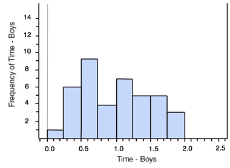
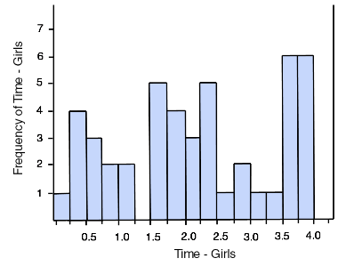

# Measures of Central Tendency - Quiz
## SWBATs
* Understand and describe the significance of measuring central tendency of continuous data
* Understand the formula and intuition behind the mean, median, mode and modal class
* Compare mean-median-mode, along with histograms to explain the central tendency of given data

### Exercise 1
Calculate the mean, median and mode for this data set: 
```
19, 18, 21, 16, 15, 17, 20, 18
```
While comparing the results of three measures, comment about this distribution. 


```python
# All three measures equal 18
# That means this is a perfectly symmetrical distribution.
```

### Exercise 2

Calculate the mean, median and mode for given distribution and state which of these measures does not describe the "middle" of this data set? and why ?
```
100, 99, 97, 97, 96, 98, 95, 72
```


```python
# Mean = 94.25, Mode = 97 and the Median = 97
# The mean does not describe the middle of the data set.  
# It is much lower than the other two averages. 
# The distribution appears to be skewed.
```

### Exercise 3
On the first three days of his bookshop opening, Joe sold 15, 18, and 16 books (He initially hoped that he would sell 17 books every day).  How many books does he need to sell on the next day to have a mean sale of 17?


```python
# He must sell at least 19 books to get a mean sale of 17
```

### Exercise 4
The histograms show the amount of time (hours per day) spent on Facebook by 46 middle school girls and 40 middle school boys from a school in San Francisco. A total of 50 boys and 50 girls took the survey, 4 girls and 10 boys did not use Facebook at all. 
Each is graphed with a bin width of 0.25 hours.




Looking at these histograms, answer following questions. 

*Hint: For most parts, you will have to figure out the location of required bins and count the frequencies. *

#### How many boys spend more than 1.5 hours/day on Facebook?


```python
# 8 boys
```

#### Compare the percentage of boys and girls that spend more than zero but less than 1 hour/day on Facebook.


```python
# Around 50% of boys and 22% of girls spend less than 1 hour/day
```

#### Find the bin where the median of the boys' data set lies.


```python
# 0.75 – 1 hour/day
```

#### In terms of Facebook usage times based on given data, what can you conclude about usage habits of boys and girls?


```python
# Girls spend much more time on these sites than boys. 
# Girls' times vary more widely, ranging from zero to 4 hours/day, 
# Boys' times top out at 2 hours/day.
```
